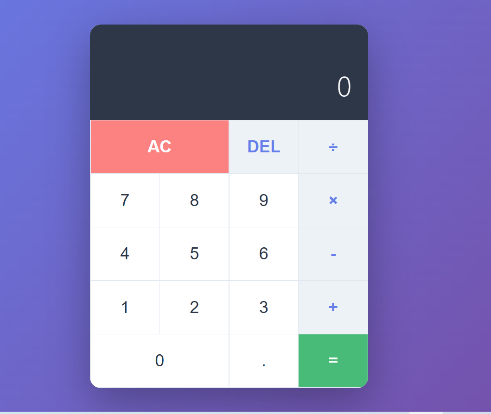

# 🧮 Calculator App

A clean and responsive **Calculator App** built with **HTML, CSS, and JavaScript**.  
This project performs basic math operations with smooth UI design and keyboard support — created from scratch using **VS Code** as part of my frontend development learning journey.

---

## 🚀 Features

- Perform basic operations: **Addition, Subtraction, Multiplication, Division**
- **Keyboard support** for faster input
- **Responsive design** for desktop and mobile
- **Error handling** (e.g., divide by zero)
- Clean, minimal, and modern user interface
- Built with focus on **code structure and logic clarity**

---

## 🧠 Technologies Used

- **HTML5** – for structure  
- **CSS3** – for layout, design, and responsiveness  
- **JavaScript (ES6 Classes)** – for core calculator logic  

---

## 📱 Responsive Design

The layout adjusts beautifully across devices:
- 🖥 Desktop: Centered UI with shadows and spacing  
- 📱 Mobile: Full-width layout and larger buttons for touch input  

---

## 🖼 Preview

> 

---

## 🌐 Live Demo

> [View on GitHub Pages / Netlify](#)  
*(Add your link once deployed)*

---

## 📫 Contact

👤 **Nouman**  
📧 [noumandevelopment@gmail.com](mailto:noumandevelopment@gmail.com)  
🌍 Open to remote opportunities  

---

⭐ *“Keep learning, keep building — growth comes one project at a time.”*
